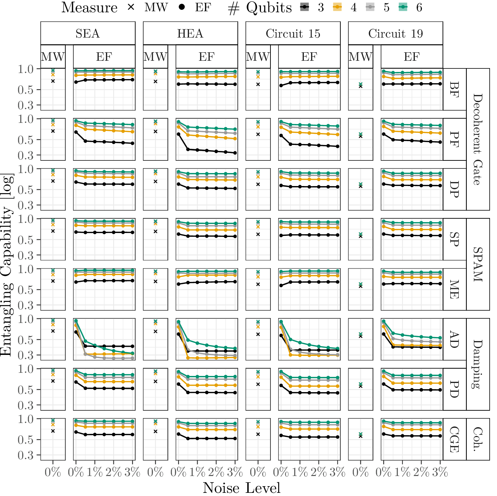

# Entanglement

Meyer-Wallach Entanglement for the pure states:

Our Figure 11 in the paper:

(Meyer-Wallach (MW) entangling capability and Entanglement of Formation (EF) under the influence of increasing noise levels. Points represent the mean of five seeds and lines are a linear interpolation to guide the eye. Shaded areas present the minimum/maximum entanglement across the five seeds. As the difference between seeds is small, it is not visible in the plot.)
