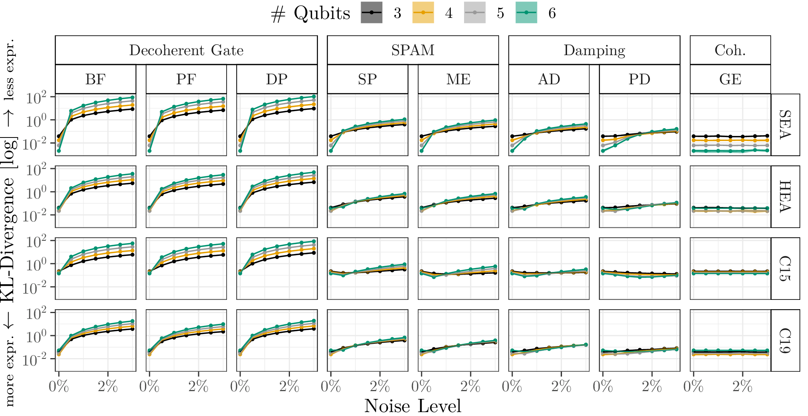

# Expressibility

Our Figure 10 in the paper:

(Expressibility (i.e. inverse of the KL-divergence) under the influence of increasing noise levels. The points represent the mean and the small shaded areas around it refer to the minimum and maximum across all five seeds.)