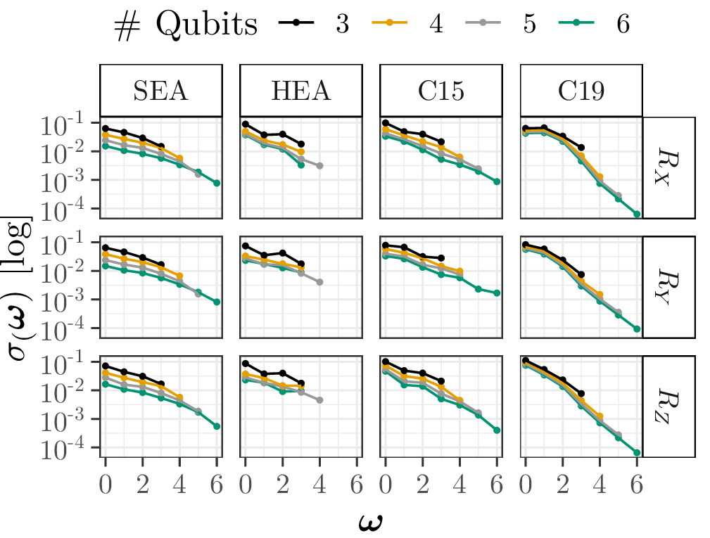

# Results

On this page you can find links and explaination to supplementary results of our paper.

## Coefficients

The resulting plots of our experiments as PDF can be found in [this subdirectory](rplots/img-gen), while a PNG version can be found below.

### Input Encoding

Our Figure 3 from the paper:

(Absolute coefficient mean $\mu_c(\boldsymbol{\omega})$ for $[3\dots 6]$ qubits and $R_{\{X, Y, Z\}}$ encodings over frequencies.)

And the corresponding relative standard deviation:

(Absolute coefficient standard deviation $\sigma_c(\boldsymbol{\omega})$ for $[3\dots 6]$ qubits and $R_{\{X, Y, Z\}}$ encodings over frequencies.)

Our Figure 4 from the paper:

(Coefficients, separated into real and imaginary parts for a circuit with six qubits and different single qubit Pauli-encodings.)

### 1D-Coefficients
### 2D-Coefficients

## Expressibility

## Entanglement
